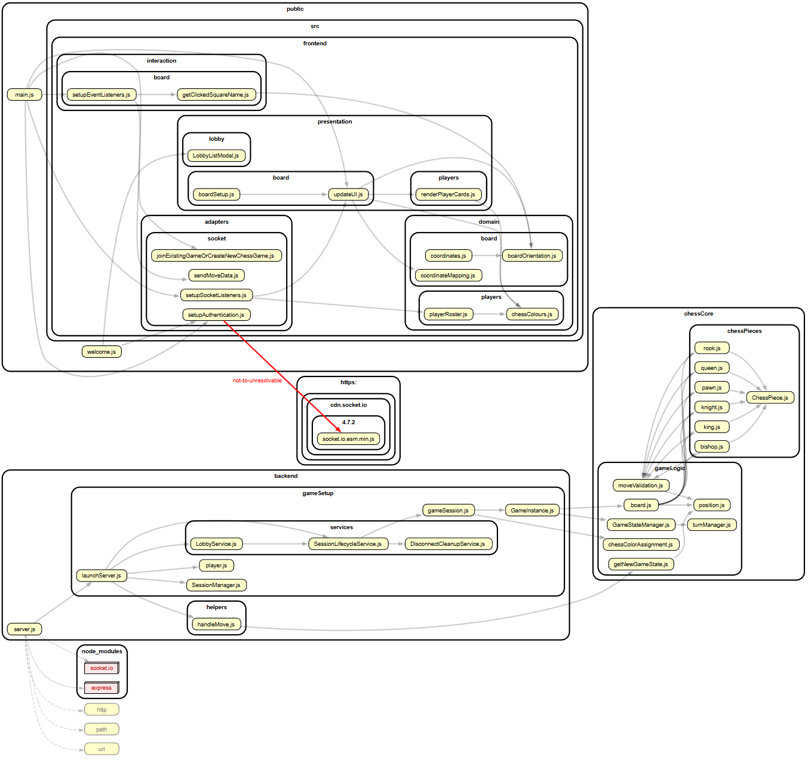

# Multiplayer Chess Platform (Portfolio Build)

This is my personal exploration of a server-authoritative multiplayer architecture for turn-based games. Chess is the flagship experience, and the platform is designed so I can layer in additional titles without rewriting networking or game rules.

## Live Deployments

- Primary (server-authoritative): https://chess-cs50-v2.fly.dev/
  The production deployment runs the full backend on Fly.io. It uses Socket.IO with server-side arbitration for moves and game state. On first hit, a cold start may take a few seconds.

- Older client-only demo: https://multiplayer-chess-qh1o.onrender.com/
  This legacy preview shows the early client-only prototype. On free-tier Render, initial boot can take ~30 seconds. To test it, open two tabs and wait for both to connect before moving; there is no lobby in this version and moving early can desync clients.

## Server-Side Refactor

- Completed and deployed to Fly.io. The backend provides Socket.IO orchestration, session lifecycle management, and domain-first chess logic.
- The refactor addresses the limitations of the client-only preview by making the server authoritative for rules and state.

## Try It Locally

```bash
npm install
npm start
```

Open two browser tabs at `http://localhost:3000` and play against yourself to see server arbitration, move validation, and game state tracking in action.

### Environment Targets

- Node.js 20+
- Modern desktop browser

## Tech Snapshot

- Real-time WebSocket play with server authority (`backend/gameSetup`).
- Game engine built from small ES6 classes (`chessCore/gameLogic`, `chessCore/chessPieces`).
- Shared utilities for coordinates and constants in `shared/utilities`.
- Static frontend assets in `public`, wired to the Socket.IO client.
- Tests aligned with a red-green-refactor flow using Jest for unit/integration coverage; Playwright is reserved for future end-to-end passes.

```bash
npm test
```

This project is organised for a server-authoritative flow: `backend` runs the Express/Socket.IO server and session lifecycle (`backend/gameSetup`), `chessCore` contains pure chess domain logic (pieces, move validation, turn/state management), `shared` provides constants and utilities used by both sides, and `public` serves the browser client that speaks to sockets. Clients emit intents; the server validates against the domain rules and broadcasts the canonical state, keeping IO at the edge and rules isolated for fast tests and predictable deployments.


## What's Next

- Add front end polish with drag to move and cleaner browser popups
- Add turn timer to make it clearer whos turn it is
- Reduce abstractions (throughout development some abstractions were made that later proved to be unnecessary)
- Add full auth flow
- Add persistent database for move and match history tied to accounts
- Expand the rules engine to support checkers as the next proof-of-flexibility.

With Fly.io live, the full experience is available without cloning. The older client-only demo remains accessible for comparison.
