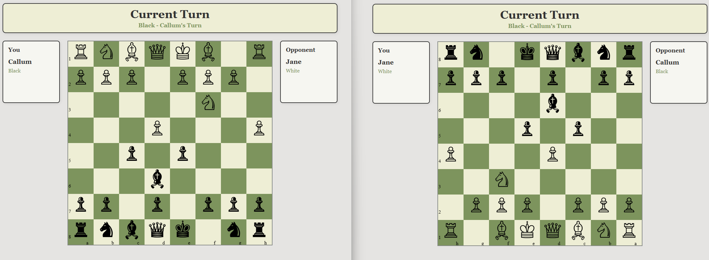

# Multiplayer Chess Platform (Portfolio Build)

This is an online multiplayer chess application with a server‑authoritative backend. I built it to practice vanilla JavaScript, ES modules, and real‑time state management over WebSockets. The architecture is modular so I can slot in other turn‑based games (like checkers) while reusing the same decoupled networking layer.

## App Screenshot



## Live Deployments

- Primary (server‑authoritative): https://chess-cs50-v2.fly.dev/
  Runs on Fly.io. Uses Socket.IO with server‑side arbitration of moves and game state. First hit may cold‑start.
  **Note that hosting is currently paused to avoid costs**

- Legacy client‑only demo: https://multiplayer-chess-qh1o.onrender.com/
  Early prototype without a lobby or server authority. On free‑tier Render it can take ~30s to boot. Open two tabs, wait for both to connect, then move.

## Tech Stack

- Backend: Node.js 20, Express 5, Socket.IO 4
- Domain: ES modules, small ES6 classes, server‑authoritative rules
- Frontend: Vanilla JS served from `public`
- Testing: Jest (jsdom) for unit + integration
- Tooling: ESLint 9, JSDoc, Dependency Cruiser
- CI/CD: GitHub Actions (Fly.io + Azure workflows)
- Deploy: Fly.io (Dockerfile included)

## Architecture

- Server‑authoritative flow: clients emit intents; the server validates with chess rules and broadcasts the canonical state.
- Clear boundaries:
  - Networking/adapters in `backend` (`gameSetup`, socket handlers, session lifecycle)
  - Pure domain logic in `chessCore` (pieces, board, position, move validation, turn management)
  - Shared utilities/constants in `shared` (hidden from diagram below for simplicity)
  - Static client in `public`
- Session lifecycle: lobby discovery, game creation/join, two‑player cap, and cleanup are handled in `backend/gameSetup` (see `SessionManager`, `LobbyService`, `SessionLifecycleService`).
- Extensibility: chess rules are isolated so another turn‑based game can reuse the same session/socket orchestration.


## Class Overview

Backend Classes:

- GameInstance - Manages a single game instance, creating the board and game state for a match.
- GameSession - Container for a match; tracks connected players and delegates game logic to its GameInstance while assigning player colours.
- Player - Represents a connected player with username, socket ID, and assigned chess colour.
- LobbyService - Coordinates lobby creation, listing, and joining with validation, acknowledgements, and broadcast updates.
- SessionLifecycleService - Orchestrates session creation/join, emits initial player/game state, and handles disconnect cleanup.
- SessionManager - In-memory registry for sessions, players, socket–session mappings, and lobby names with lookup and indexing helpers.

GameLogic Classes:

- Board - Represents the chessboard grid, initializes pieces, and answers square existence/emptiness queries.
- GameStateManager - Applies moves, switches turns, tracks captured pieces, and sets win state.
- MoveValidation - Provides shared movement and capture validation helpers including line-of-sight checks.
- Position - Encapsulates board coordinates, neighbor squares, and path traversal checks.
- TurnManager - Switches the current player and exposes whose turn it is.

ChessPiece Classes:

- ChessPiece - Base piece entity holding name, colour, position, and move state.
- King - Moves one square in any direction and is the loss condition when captured.
- Queen - Moves any number of squares horizontally, vertically, or diagonally.
- Rook - Moves any number of squares along ranks and files; cannot jump pieces.
- Bishop - Moves any number of squares diagonally; cannot jump pieces.
- Knight - Moves in an L-shape and can jump over pieces.
- Pawn - Moves forward (with first-move double step) and captures diagonally.

## Project Structure

- `backend/`: Express + Socket.IO server, session lifecycle, socket handlers
- `chessCore/`: chess engine (Board, Position, TurnManager, move validation, piece classes)
- `shared/`: constants and utilities shared by server and client
- `public/`: static assets (HTML/CSS/JS) that speak to sockets
- `tests/`: unit and integration tests (Jest)

## Socket Event Flow

- Client to Server (request then ack)
  - `lobby:create` — client sends `{ lobbyName, colour }`. Server creates a new session, reserves the colour, and acknowledges with `{ gameSessionID }` or `{ error }`.
  - `lobby:list` — client requests the available lobbies. Server acknowledges with `{ lobbies }`.
  - `lobby:join` — client sends `{ gameSessionID, lobbyName }`. Server validates if session is full, joins the session, and acknowledges with `{ ok: true, gameSessionID }` or `{ error }`.
  - `move` — client sends `{ chessPiece, targetSquare }`. Server verifies turn and move legality, applies the move, updates game state, and emits `newGameState` to both players. On invalid attempts, server emits `notYourTurn` or `error`.

- Server to Client (push)
  - `connected` — sent after connect with `{ username, socketId, message }`.
  - `playerInfoAndInitialGameState` — sent after create/join with `{ username, colour, gameInstance, players }`.
  - `session:players` — sent when the player roster changes with `{ players: [{ username, colour }] }`.
  - `lobbies:updated` — sent when lobby list changes with `{ lobbies }`.
  - `newGameState` — sent after a valid move containing the updated game state.
  - `notYourTurn` — sent when a player attempts to move out of turn.
  - `error` — sent for errors with `{ code, message }` or a message string.

Legacy events like `createNewChessGame`, `joinExistingGame`, and `getAvailableGames` are still handled for backwards compatibility but are not part of the current lobby flow.

## Run Locally

Requirements: Node.js 20+

```powershell
npm install
$env:PORT=3000  # optional; defaults to 3000
npm start
```

Open two tabs at `http://localhost:3000` and play against yourself to see server arbitration, validation, and state sync.

## Testing

- Jest config uses jsdom; no Babel transform is required for ESM.
- Current count: 233 individual unit tests and 20 integration tests

```powershell
npm test
```

## Why This Architecture

- Predictable rules: chess logic lives in pure modules (`chessCore`), making tests fast and debugging easier.
- Clear IO boundary: sockets and HTTP live at the edge; the domain stays framework‑agnostic.
- Multi‑game ready: session/lobby orchestration is generic enough to support other turn‑based games.

## Roadmap

- Delete legacy functions from old event flow
- Add better checkmate detection, current chess version has a simplified way of winning
- Frontend polish: drag‑to‑move and cleaner UI prompts
- Turn timer to make it clear whose turn it is
- Prune abstractions added early that no longer pay for themselves
- Full auth flow
- Persistence: database for move and match history tied to accounts
- Add checkers to demonstrate engine/lobby reuse

With Fly.io live, the full experience is available without cloning. The older client‑only demo remains for comparison.
